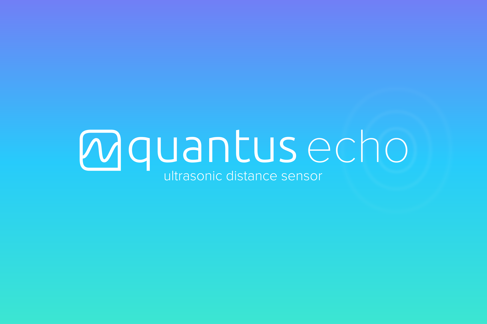

# Quantus

Work in progress

Quantus is a precision, low-cost, and user-friendly measurement apparatus for high school science labs to make experiments meaningful and accessible. Quantus Echo, the first device I am creating, takes distance-time measurements at 20Hz.

### About Quantus
[www.lelandjansen.com/project/quantus](http://www.lelandjansen.com/project/quantus)
